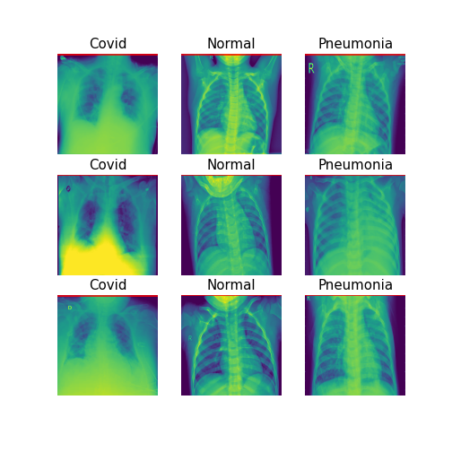
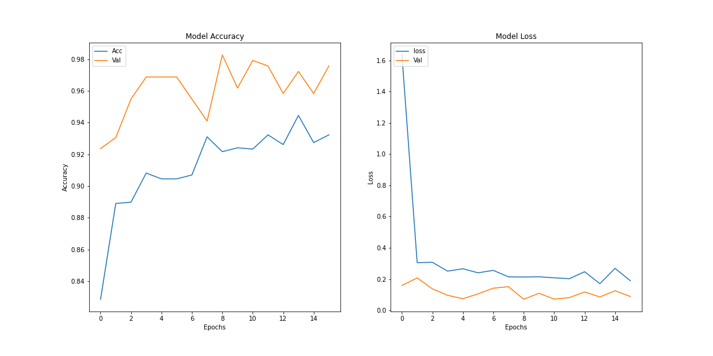

# Covid-19 Chest X-Ray Classification
This project contains 2 parts:

__Part1__ aims to classify X-Ray images into 3 classes:

* COVID 
* NORMAL
* VIRAL PNEUMONIA

__Part2__ consists of creating and deploying the model into a web applicaton

## The Dataset:

__Dataset Discription__

The dataset used in this project is found [here](https://www.kaggle.com/tawsifurrahman/covid19-radiography-database) .

This dataset is composed of 3 folders:

1- Covid-19 : 1143 images

2- Normal : 1341 images

3- Viral Pneumonia 1345 images

__Dataset Overview__




## Data Pre-processing and augmentation

__Organizing the data__

Using the script `Data_preprocessing.py`, the raw data was re-organized like so:
```
Data
│
└───train
│   │
│   └───Covid
│   └───Normal
│   └───Viral Pnaumonia
│   
└───test
│   └───Covid
│   └───Normal
│   └───Viral Pnaumonia
```

__Augmenting the data__

After applying several operations like _scaling_, _horizental an vertical flip_, _zoom_, _rotation_, etc. the data generated is like so:
```
For the train dataset: Found 2451 images belonging to 3 classes 
For the validation dataset: Found 611 images belonging to 3 classes.
For the test dataset: Found 767 images belonging to 3 classes.
```

## Model Training and Evaluation
The training was made via transfer learning using the pre-trained model `DenseNet`.

All the caode details are in the `model.py` notebook and the weights will be saved into a `model.hdf5` file to be used for future predictions.

The accuracy of the model upon evaluation on the test set was __98%__, below are the training metrics




## Model Deployment
